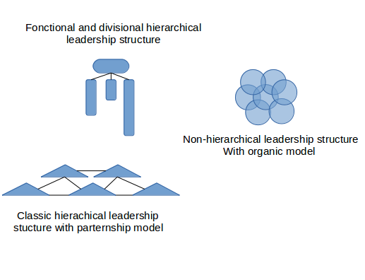

# Ethereum Structure and Organisation: The co-existence of vertical and horizontal structures

## Hierarchical leadership structures:
Fast at decision making in a stable environement, often super specialised they exist to build and maintain the foundation for a strong ecosystem.

The trade off: Less mobile to adapt changing condition in an instable environement, often less inclusive, more opaque, tend to produce silos of informations, required considerable amount of ressource and energy to maintain power and balance.

## Horizontal leadership structure:
Based around collaboration, coordination and the shared responsibility of group of individuals and organisation.

They are more more mobile to adapt changing condition in an instable environement, innovative, dynamic, fair and inclusive, more transparent and less costly to maintain, they exist to guarantee the longevity of his ecosystem while allowing a constant renewal of its participants.

Trade off: can be slow and less efficient at making decision in a stable environement, tend to become instable in the long term.

In the Ethereum Ecosystem differentes leaderships model coexist:

- Some use classic hierarchical leadership structure and fonction like a classic coorporate model.

- Some of these organisations have started with an hierarchical leadership structures in order to achieve strategic objectif and then, have already or will switch to an horizontal structure and decreased their size.

- Some of these organisation are pure non-hierarchical structures where share power and responsibility is the center of their Holacracy.

- Some of these organisation have opted for a partnership model over pure competition.
They have often more or less a hierarchical leadership structures internaly but collaborate and coordinate horizontaly through consensus with other organisation.

- Some of these organisation have opted for a Hybrid modele

# List of Ethereum projects classify by leadership structures

To Do